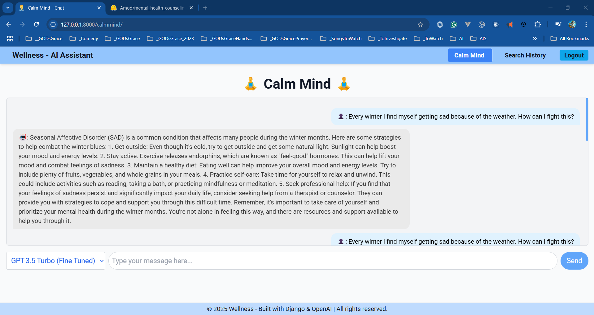

# 🧘‍♂️ Calm Mind – AI Powered Mental Health Counseling bot 🧘‍♂️

A `Django-based AI chatbot` leveraging `OpenAI's NLP` to offer empathetic mental health support.

## 🌟 Overview

**CalmMind** is a conversational chatbot designed to provide empathetic, AI-driven support for mental health and emotional well-being. Built with `Django`, `OpenAI’s NLP`, and a user-friendly `HTML/CSS/JavaScript` interface, it enables secure, real-time conversations to help users feel heard, supported, and guided.

## 📝 Todo list

- [ ] Create a new Django app for the external service logic.
- [ ] Define API endpoints using Django REST Framework (DRF).
- [ ] Move external service logic from views.py to the new app.
- [ ] Integrate the new app with the main project by including it in INSTALLED_APPS and routing its URLs.
- [ ] Create a new Django app: For example, api_service.
- [ ] Define API endpoints: Use Django REST Framework (DRF) to create RESTful APIs.
- [ ] Implement authentication for API endpoints to ensure secure access.
- [ ] Write unit tests for the new app to ensure functionality and reliability.

## 🔧 Tech Stack

- `Backend:` Django (Python)
- `AI Engine:` OpenAI API (GPT-based models)
- `Frontend:` HTML, CSS, JavaScript
- `Deployment Ready:` Scalable and secure for real-world use

## 🚀 Key Features

- 💬 `Conversational AI` for mental health support
- 🧠 `Context-aware responses` powered by OpenAI
- 🔒 `Secure, scalable Django backend`
- 🌐 `Responsive web interface`
- 🛠️ `Easily customizable` for future enhancements

## 📦 Deliverables

- ✅ Fully functional `Django web app` with real-time AI chatbot
- ✅ Seamless `OpenAI integration` for rich NLP-based conversations
- ✅ Flexible foundation for future mental health tech innovations

## 🎨 UI Preview



## 💡 Vision

CalmMind is built with compassion and cutting-edge technology to bridge the gap between emotional support and digital accessibility—making mental health care more approachable, one chat at a time.

## Reference(s)

> 1. [Datasets: Mental Health Counseling Conversations](https://huggingface.co/datasets/Amod/mental_health_counseling_conversations)
> 1. [Favicon](https://favicon.io/emoji-favicons/)
> 1. [OpenAI API](https://platform.openai.com/docs/api-reference/chat/create)
> 1. [Django](https://www.djangoproject.com/)
> 1. [Tailwind CSS](https://tailwindcss.com/docs/installation)

## 🛠 Project Setup

### 1. Create & Activate a Virtual Environment

```bash
git clone https://github.com/Swamy-s-Tech-Skills-Academy-AI-ML-Data/CalmMind.git
cd CalmMind

python -m venv .venv
.venv\Scripts\activate  # Windows
source .venv/bin/activate  # macOS/Linux

pip install --upgrade pip
pip install -r requirements.txt
```

### 2. Initialize Django Project

```bash
django-admin startproject calmmind_portal_main .
cd src
python manage.py makemigrations
python manage.py migrate
python manage.py runserver
```

### **3. Create the "calmmind" App**

```bash
python manage.py startapp calmmind
```

#### **Add `calmmind` to `INSTALLED_APPS` in `settings.py`:**

```python
INSTALLED_APPS = [
    ...existing apps...,
    'calmmind',
]
```

```bash
python manage.py makemigrations
python manage.py migrate
```

👉 **Access your chatbot** at: [http://127.0.0.1:8000](http://127.0.0.1:8000)

## Sample Prompts

```text
Every winter I find myself getting sad because of the weather. How can I fight this?
```

## UI First Look


## Project Setup

```powershell
python --version
pip --version
(.venv) PS D:\STSAAIMLDT\CalmMind> python --version
Python 3.12.5
(.venv) PS D:\STSAAIMLDT\CalmMind> pip --version
pip 25.0.1 from D:\STSAAIMLDT\CalmMind\.venv\Lib\site-packages\pip (python 3.12)
(.venv) PS D:\STSAAIMLDT\CalmMind>

pip install virtualenv
python -m venv .venv
.venv/Scripts/activate
python -m pip install --upgrade pip

pip install flask openai python-dotenv flask_sqlalchemy

pip freeze > requirements.txt
pip install -r .\requirements.txt
```

## Overview

CalmMind is an AI-driven chatbot designed to provide empathetic and insightful mental health support. Built using **Django**, **OpenAI’s NLP models**, and web technologies (**HTML, CSS, JavaScript**), it enables users to engage in meaningful conversations, offering guidance, emotional support, and wellness resources.

## **Project Scope**

This project consists of two main phases:

1. **AI Model Training** – Utilizing OpenAI’s API to equip the chatbot with intelligent, context-aware responses tailored to mental health concerns.
2. **Django Integration** – Embedding the trained model into a secure, scalable Django web application for real-time user interactions.

## **Key Features**

✔️ AI-powered chatbot for mental health counseling  
✔️ OpenAI-driven NLP for thoughtful, context-aware responses  
✔️ Secure and scalable **Django framework**  
✔️ User-friendly web interface (**HTML, CSS, JavaScript**)  
✔️ Customizable chatbot behavior for personalized interactions

## **Project Description**

This project develops an AI-powered mental health chatbot using OpenAI's API and Django. The chatbot provides empathetic, real-time support through meaningful conversations, addressing diverse mental health concerns. It combines advanced NLP with a secure, scalable web application to deliver a user-friendly tool for mental well-being.

## **Installation & Usage**

1. Clone the repository:

   ```bash
   git clone https://github.com/vishipayyallore/CalmMind.git
   ```

2. Navigate to the project directory:

   ```bash
   cd CalmMind
   ```

3. Install dependencies:

   ```bash
   pip install -r requirements.txt
   ```

4. Run the Django server:

   ```bash
   python manage.py runserver
   ```

5. Access the chatbot in your browser and start a conversation!

## **Data Files**

The `data` folder contains the following files:

1. **`train.jsonl`**: This file stores the training dataset in JSONL format, which is used to fine-tune the chatbot model. Each line in the file represents a JSON object containing structured data for training.

2. **`validation.jsonl`**: This file contains the validation dataset in JSONL format, used to evaluate the chatbot model's performance during fine-tuning. Each line represents a JSON object for validation.

> **Note**: These files are excluded from version control using `.gitignore` to ensure sensitive or large data is not committed to the repository.

Here's a clean, **consolidated version** of your CalmMind README that combines clarity, structure, and professionalism, while staying concise and impactful:

---

## Creation of a Virtual Environment and clammind_main project

### 1. Create a Virtual Environment

1. Clone the repository:

   ```bash
   git clone https://github.com/Swamy-s-Tech-Skills-Academy-AI-ML-Data/CalmMind.git
   cd CalmMind
   ```

2. Create a Virtual Environment and activate it:

   ```bash
   python -m venv .venv
   .venv\Scripts\activate  # On Windows
   source .venv/bin/activate  # On macOS/Linux
   pip freeze  # Should show no packages installed
   ```

3. Install dependencies:

   ```bash
   pip install django
   pip install --upgrade pip
   pip install python-dotenv
   pip freeze # It should show the installed packages
   pip freeze > requirements.txt
   ```

4. Install dependencies from `requirements.txt`:

   ```bash
   pip install -r requirements.txt
   ```

5. Create the Django project:

> 1. (.venv) PS D:\STSAAIMLDT\CalmMind\src>
> 2. Create a new Django project

```bash
    django-admin startproject calmmind_portal_main .
    cd src
```

6. Apply migrations:

   ```bash
   python manage.py makemigrations
   python manage.py migrate
   ```

7. Run the development server:

   ```bash
   python manage.py runserver
   ```

## Creating the "calmmind" App

To create the `calmmind` app for managing student-related features, follow these steps:

1. Navigate to the `src` directory:

   ```bash
   cd src
   ```

2. Create the `calmmind` app using Django's `startapp` command:

   ```bash
   python manage.py startapp calmmind
   ```

3. Add the `calmmind` app to the `INSTALLED_APPS` list in `student_portal_main/settings.py`:

   ```python
   INSTALLED_APPS = [
       ...existing apps...
       'calmmind',
   ]
   ```

4. Define models for the `calmmind` app in `calmmind/models.py`.

5. Run migrations to apply any changes:

   ```bash
   python manage.py makemigrations
   python manage.py migrate
   ```

6. Create views, serializers, and URLs for the `calmmind` app as needed.

> 1. [calmmind endpoints](http://127.0.0.1:8000/calmmind/) - This URL will be used to access the student portal.

# CalmMind

---

## 🛠️ Installation & Usage

```bash
# 1. Clone the repository
git clone https://github.com/vishipayyallore/CalmMind.git

# 2. Navigate to the project folder
cd CalmMind

# 3. Install dependencies
pip install -r requirements.txt

# 4. Run the Django development server
python manage.py runserver
```

👉 Open your browser and visit: [http://127.0.0.1:8000](http://127.0.0.1:8000) to start a session.

---

## 🤝 Contribution Guidelines

We welcome contributions to CalmMind! To contribute:

1. **Fork the repository** on GitHub.
2. **Clone your fork** to your local machine.
3. **Create a new branch** for your feature or bug fix:
   ```bash
   git checkout -b feature-name
   ```
4. **Make your changes** and commit them with clear messages:
   ```bash
   git commit -m "Add feature-name: Description of changes"
   ```
5. **Push your changes** to your fork:
   ```bash
   git push origin feature-name
   ```
6. **Submit a pull request** to the main repository.

---

## 🌐 Deployment Instructions

To deploy CalmMind to a production environment:

1. **Set up a production server** (e.g., AWS, Azure, or Heroku).
2. **Install required dependencies** on the server:
   ```bash
   pip install -r requirements.txt
   ```
3. **Set up environment variables** for sensitive data (e.g., OpenAI API keys).
4. **Run database migrations**:
   ```bash
   python manage.py migrate
   ```
5. **Collect static files**:
   ```bash
   python manage.py collectstatic
   ```
6. **Start the server** using a production-ready WSGI server (e.g., Gunicorn):
   ```bash
   gunicorn calmmind_portal_main.wsgi:application
   ```

---

## 📊 Data File Details

### `train.jsonl`

- **Purpose**: Used for fine-tuning the chatbot model.
- **Structure**: JSONL format with each line representing a training example.

### `validation.jsonl`

- **Purpose**: Used for evaluating the chatbot model's performance.
- **Structure**: JSONL format with each line representing a validation example.

> **Note**: These files are excluded from version control to protect sensitive data and reduce repository size.

---

---

---

---

## 🛠️ Installation & Usage

```bash
# 1. Clone the repository
git clone https://github.com/vishipayyallore/CalmMind.git

# 2. Navigate to the project folder
cd CalmMind

# 3. Install dependencies
pip install -r requirements.txt

# 4. Run the Django development server
python manage.py runserver
```

---

## 📊 Data File Details

### `train.jsonl`

- **Purpose**: Used for fine-tuning the chatbot model.
- **Structure**: JSONL format with structured training data.

### `validation.jsonl`

- **Purpose**: Used for model performance evaluation.
- **Structure**: JSONL format with validation examples.

> **Note**: These files are excluded from version control to protect sensitive data and reduce repository size.

---

## 🤝 Contribution Guidelines

We welcome contributions! Follow these steps to contribute:

1. **Fork the repository** on GitHub.
2. **Clone your fork** to your local machine.
3. **Create a new branch** for your feature or bug fix:
   ```bash
   git checkout -b feature-name
   ```
4. **Make your changes** and commit them with clear messages:
   ```bash
   git commit -m "Add feature-name: Description of changes"
   ```
5. **Push your changes** to your fork:
   ```bash
   git push origin feature-name
   ```
6. **Submit a pull request** to the main repository.

---

## 🌐 Deployment Instructions

To deploy CalmMind to a production environment:

1. **Set up a production server** (e.g., AWS, Azure, or Heroku).
2. **Install required dependencies** on the server:
   ```bash
   pip install -r requirements.txt
   ```
3. **Set up environment variables** for sensitive data (e.g., OpenAI API keys).
4. **Run database migrations**:
   ```bash
   python manage.py migrate
   ```
5. **Collect static files**:
   ```bash
   python manage.py collectstatic
   ```
6. **Start the server** using a production-ready WSGI server (e.g., Gunicorn):
   ```bash
   gunicorn calmmind_portal_main.wsgi:application
   ```

---

This version **removes redundancies**, **keeps everything structured**, and **ensures clarity and professional presentation**. Let me know if you'd like further refinements! 🚀
