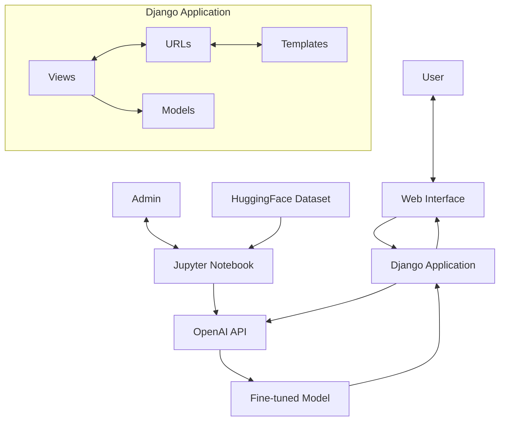

# CalmMind Bot - Architecture Diagram

## Components Overview

The CalmMind Bot architecture consists of two main components:

1. **Model Fine-tuning Pipeline**
   - Data processing and preparation
   - OpenAI API integration for fine-tuning
   - Model evaluation

2. **Django Web Application**
   - User interface
   - API integration
   - Response handling

## Diagram Elements

### Data Flow
1. User inputs message via web interface
2. Django backend processes request
3. OpenAI API generates response using fine-tuned model
4. Response is displayed to user

### System Components
- **Frontend Layer**: HTML/CSS/JS with Tailwind
- **Backend Layer**: Django web application
- **AI Layer**: Fine-tuned OpenAI GPT model
- **Data Layer**: Training datasets and conversation history

### External Services
- OpenAI API for model hosting and inference
- Hugging Face for dataset source

## Suggested Diagram Layout

```
┌─────────────────────────────────────────────────────────────────────────┐
│                             CalmMind System                              │
│                                                                         │
│  ┌────────────┐                                          ┌────────────┐ │
│  │            │                                          │            │ │
│  │   User     │◄─────────────────────────────────────►  │   Admin    │ │
│  │            │                                          │            │ │
│  └────────────┘                                          └────────────┘ │
│         │                                                       │       │
│         ▼                                                       ▼       │
│  ┌────────────┐                                          ┌────────────┐ │
│  │            │                                          │            │ │
│  │ Web Browser│                                          │  Jupyter   │ │
│  │ Interface  │                                          │  Notebook  │ │
│  │            │                                          │            │ │
│  └────────────┘                                          └────────────┘ │
│         │                                                       │       │
│         ▼                                                       ▼       │
│  ┌────────────────────────────────────────────────────────────────────┐│
│  │                       Django Application                           ││
│  │  ┌────────────┐    ┌────────────┐    ┌────────────┐               ││
│  │  │            │    │            │    │            │               ││
│  │  │  Views     │◄──►│   URLs     │◄──►│  Templates │               ││
│  │  │            │    │            │    │            │               ││
│  │  └────────────┘    └────────────┘    └────────────┘               ││
│  │         │                                                          ││
│  │         ▼                                                          ││
│  │  ┌────────────┐                                                    ││
│  │  │            │                                                    ││
│  │  │  Models    │                                                    ││
│  │  │            │                                                    ││
│  │  └────────────┘                                                    ││
│  │                                                                    ││
│  └────────────────────────────────────────────────────────────────────┘│
│         │                                │                              │
│         ▼                                ▼                              │
│  ┌────────────┐                   ┌────────────┐                       │
│  │            │                   │            │                       │
│  │ OpenAI API │◄─────────────────┤ HuggingFace│                       │
│  │            │                   │  Dataset   │                       │
│  └────────────┘                   │            │                       │
│         │                         └────────────┘                       │
│         ▼                                                              │
│  ┌────────────┐                                                        │
│  │            │                                                        │
│  │ Fine-tuned │                                                        │
│  │   Model    │                                                        │
│  │            │                                                        │
│  └────────────┘                                                        │
│                                                                         │
└─────────────────────────────────────────────────────────────────────────┘
```

## Recommended Tools for Creating the Diagram

1. **Draw.io (diagrams.net)** - Free online diagram software
   - URL: [https://app.diagrams.net/](https://app.diagrams.net/)
   - Easy to use
   - Exports to PNG, SVG, PDF
   - Can be used in browser or as desktop application

2. **Lucidchart** - Professional diagramming tool
   - URL: [https://www.lucidchart.com/](https://www.lucidchart.com/)
   - More advanced features
   - Collaborative editing
   - Good selection of templates

3. **Microsoft Visio** - Enterprise solution
   - Comprehensive diagramming
   - Integration with Microsoft Office

4. **Mermaid Live Editor** - Code-based diagrams
   - URL: [https://mermaid.live/](https://mermaid.live/)
   - Paste the Mermaid code below to instantly generate a diagram
   - Download as PNG or SVG for your presentation

## Simple Implementation Using Mermaid.js Syntax



## Color Scheme Suggestion

For a professional and visually appealing diagram, consider using these colors:

- **Frontend Components:** #4299E1 (Blue)
- **Backend Components:** #48BB78 (Green)
- **AI Components:** #805AD5 (Purple)
- **Data Components:** #F6AD55 (Orange)
- **Arrows/Connections:** #718096 (Gray)
- **Background:** White or light gray
- **Borders:** Dark gray

## Quick Steps for Your Presentation

1. Visit [Mermaid Live Editor](https://mermaid.live/)
2. Paste the Mermaid code above
3. Download as PNG or SVG
4. Include in your presentation slides for the architecture overview section
5. Use the diagram to explain the data flow during your demo

This architecture diagram will help your audience understand how the CalmMind system components interact, making your technical explanation more accessible.