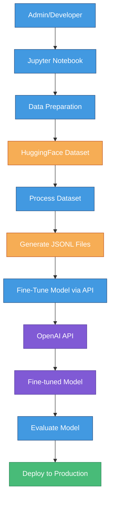
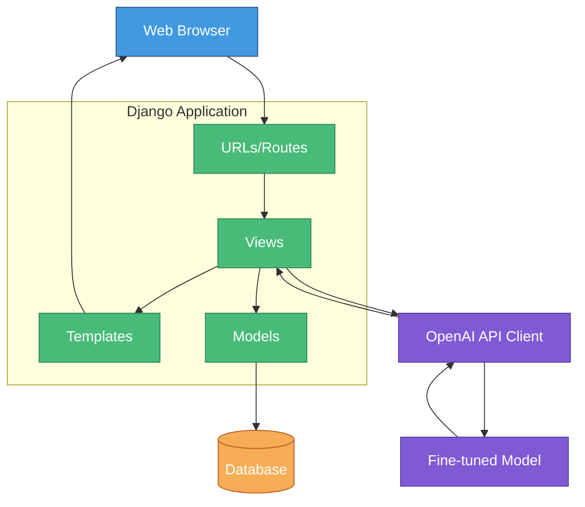
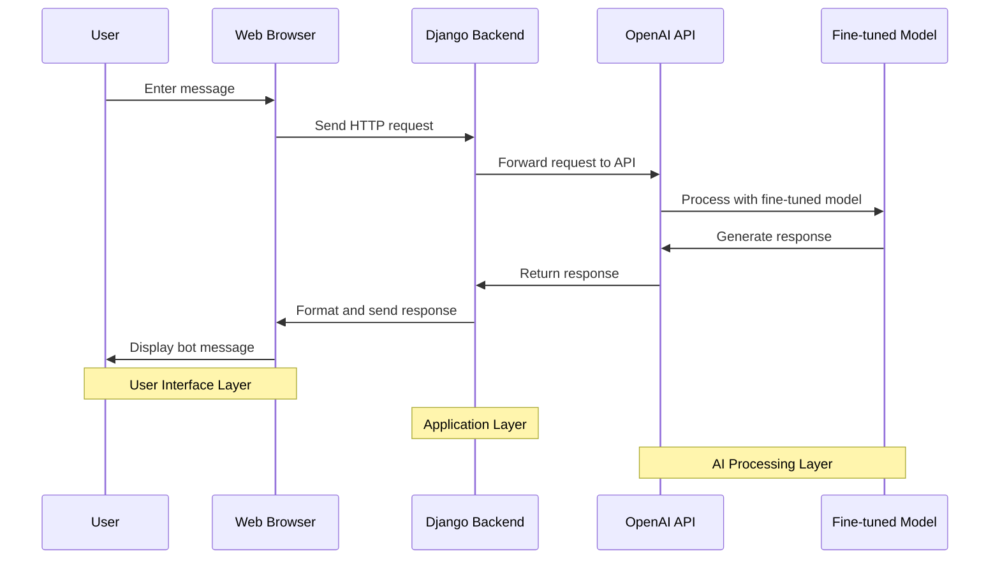

# CalmMind Bot - Separate Architecture Components

This document provides focused Mermaid diagrams for three key aspects of the CalmMind architecture: Admin Flow, Django Application, and User Flow. You can use these diagrams separately in your presentation to focus on specific aspects of the system.

## A. Admin Flow Diagram

This diagram illustrates the workflow for administrators (developers) fine-tuning and managing the AI model.

## B. Django Application Architecture

This diagram focuses on the internal structure of the Django application and how its components interact.

## C. User Flow Diagram

This diagram shows the user experience flow and how user interactions are processed through the system.

## Quick Steps for Using These Diagrams

1. Visit [Mermaid Live Editor](https://mermaid.live/)
2. Copy and paste each Mermaid code block separately
3. Download each diagram as PNG or SVG
4. Add each diagram to your presentation slides

## Presentation Tips

When presenting these diagrams:

1. **Admin Flow**: Use this when explaining the model fine-tuning process and how the model is prepared for the application.

2. **Django Application**: Present this when diving into the technical architecture of your web application, explaining how the components interact.

3. **User Flow**: Show this when demonstrating the user experience, walking through what happens from when a user types a message to when they receive a response.

You can also consider creating a slide that shows all three diagrams side by side to give a complete picture of your system, then focus on each component in subsequent slides.